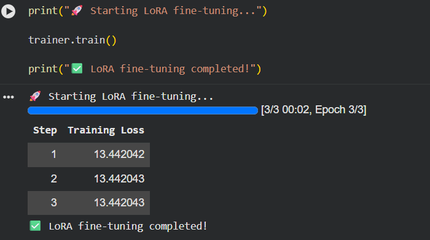
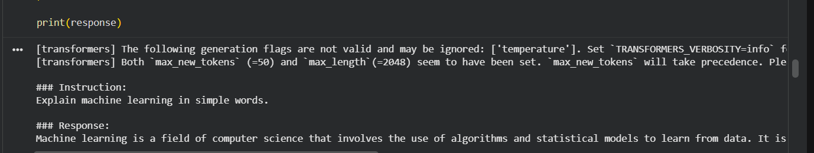

# LLM Fine-Tuning Comparative Study: LoRA vs QLoRA

## Overview

This project presents a research experiment on **Parameter-Efficient Fine-Tuning (PEFT)** of a Large Language Model using **LoRA (Low-Rank Adaptation)** and **QLoRA (Quantized Low-Rank Adaptation)** techniques.

The experiment fine-tunes **TinyLlama-1.1B-Chat-v1.0** using Hugging Face Transformers and PEFT libraries. The goal is to understand and compare memory-efficient methods for adapting Large Language Models without performing full model training.

The complete workflow includes:

- Dataset preparation
- Tokenization
- LoRA fine-tuning
- QLoRA fine-tuning with 4-bit quantization
- GPU-based training
- Model saving
- Inference evaluation


---

# Research Objective

Large Language Models contain billions of parameters, making full fine-tuning expensive in terms of GPU memory and computation.

This research experiment investigates:

- How LoRA reduces trainable parameters during LLM fine-tuning
- How QLoRA improves memory efficiency using quantization
- Comparison between LoRA and QLoRA approaches
- Practical implementation of PEFT techniques using Hugging Face


---

# Model and Dataset

## Base Model

**TinyLlama-1.1B-Chat-v1.0**

- Model Type: Causal Language Model
- Parameters: Approximately 1.1 Billion
- Framework: Hugging Face Transformers


## Dataset

A custom instruction-response dataset was created for supervised fine-tuning.

Example:

```json
{
  "instruction": "Explain machine learning in simple words.",
  "response": "Machine learning allows computers to learn patterns from data and make predictions."
}
```


---

# Experimental Setup

## Hardware

- Google Colab
- NVIDIA Tesla T4 GPU


## Technologies Used

- Python
- PyTorch
- Hugging Face Transformers
- Hugging Face PEFT
- LoRA
- QLoRA
- BitsAndBytes
- Accelerate


---

# Experiment 1: LoRA Fine-Tuning

## Method

LoRA introduces trainable adapter layers while keeping the original model weights frozen.

Instead of updating all parameters of the 1.1B parameter model, only a small number of adapter parameters are trained.


## LoRA Configuration

- Rank (r): 8
- LoRA Alpha: 16
- Dropout: 0.05
- Target Modules:
  - q_proj
  - v_proj


## LoRA Training Result

```
Trainable Parameters: 1,126,400
Total Parameters: 1,101,174,784
Trainable Percentage: 0.1023%
```

LoRA successfully fine-tuned TinyLlama with a very small percentage of trainable parameters.


---

# Experiment 2: QLoRA Fine-Tuning

## Method

QLoRA combines:

- 4-bit model quantization
- LoRA adapter fine-tuning

The base model is loaded in a compressed format, reducing GPU memory usage while maintaining fine-tuning capability.


## QLoRA Configuration

- Quantization: 4-bit
- Quantization Method: NF4
- Compute Type: Float16


## QLoRA Training Result

```
Trainable Parameters: 1,126,400
Total Parameters: 1,101,174,784
Trainable Percentage: 0.1023%
```

QLoRA successfully performed memory-efficient fine-tuning using Tesla T4 GPU.


---

# LoRA vs QLoRA Comparison

| Feature | LoRA | QLoRA |
|---|---|---|
| Base Model | TinyLlama-1.1B | TinyLlama-1.1B |
| Fine-Tuning Approach | Adapter Training | Quantized Adapter Training |
| Quantization | No | 4-bit NF4 |
| Trainable Parameters | 1.12M | 1.12M |
| Trainable Percentage | 0.1023% | 0.1023% |
| GPU Used | Tesla T4 | Tesla T4 |
| Memory Efficiency | High | Higher |
| PEFT Technique | Yes | Yes |


---

# Training Results

## LoRA Training

LoRA fine-tuning completed successfully.




## QLoRA Training

QLoRA fine-tuning completed successfully using 4-bit quantization.


---

# Inference Results

After fine-tuning, the model was tested with new instructions.

Example:

**Instruction:**

```
Explain machine learning in simple words.
```

**Generated Response:**



---

# Project Structure

```
llm-lora-qlora-comparative-study/

│
├── llm_lora_qlora_comparative_study.ipynb
├── train_lora.py
├── train.json
├── requirements.txt
│
├── gpu_tesla.png
├── lora_training.png
├── qlora_training.png
├── qlora_quantization.png
├── qlora_setup.png
└── inference_result.png
```


---

# Key Learnings

Through this research experiment, the following concepts were explored:

- Large Language Model fine-tuning
- Parameter-Efficient Fine-Tuning (PEFT)
- LoRA adapter training
- QLoRA with 4-bit quantization
- Hugging Face Transformers ecosystem
- GPU-based LLM experimentation
- Efficient model adaptation


---

# Conclusion

This experiment demonstrates that Large Language Models can be efficiently adapted without full model retraining.

LoRA reduces computational cost by training only a small number of parameters, while QLoRA further improves efficiency through quantization.

The study highlights how modern PEFT techniques enable practical LLM fine-tuning on limited GPU resources such as NVIDIA Tesla T4.


---

# Author

**Sri Sowmya Gunnam**

Computer Science & Data Science Student

GitHub: srisowmya509
